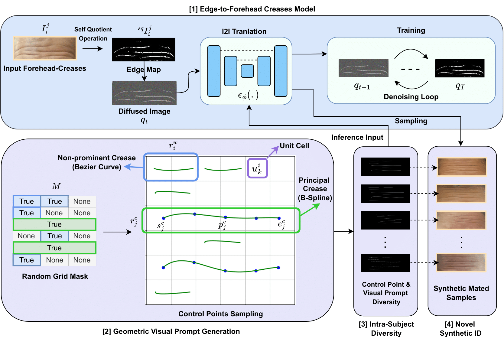

## Generating Realistic Forehead-Creases for User Verification via Conditioned Piecewise Polynomial Curves

#### [Abhishek Tandon<sup>1</sup>](https://scholar.google.com/citations?user=0sXfNaQAAAAJ&hl=en), [Geetanjali Sharma<sup>1</sup>](https://scholar.google.com/citations?hl=en&user=Np8VOOAAAAAJ&view_op=list_works&sortby=pubdate), [Gaurav Jaswal<sup>2</sup>](https://scholar.google.co.in/citations?user=otGsksUAAAAJ&hl=en), [Aditya Nigam<sup>1</sup>](https://faculty.iitmandi.ac.in/~aditya/), [Raghavendra Ramachandra<sup>3</sup>](https://scholar.google.com/citations?user=OIYIrmIAAAAJ&hl=en)

##### <sup>1</sup>IIT Mandi, India, <sup>2</sup>TIH, IIT Mandi, India, <sup>3</sup>NTNU, Norway

--------



> We propose a trait-specific image generation method that models forehead creases geometrically using B-spline and Bézier curves. This approach ensures the realistic generation of both principal creases and non-prominent crease patterns effectively constructing detailed and authentic forehead-crease images. These geometrically rendered images serve as visual prompts for a diffusion-based Edge-to-Image translation model which generates corresponding mated samples. The resulting novel synthetic identities are then used to train a forehead-crease verification network. To enhance intra-subject diversity in the generated samples we employ two strategies: (a) perturbing the control points of B-splines under defined constraints to maintain label consistency and (b) applying image-level augmentations to the geometric visual prompts such as dropout and elastic transformations specifically tailored to crease patterns. By integrating the proposed synthetic dataset with real-world data our method significantly improves the performance of forehead-crease verification systems under a cross-database verification protocol.


## Render Creases

Render Raw Samples (1 Image per ID):
```
python render.py
```
Add Visual Prompt Diversity (VPD) to raw samples:

```
python augs.py
```

## Edge2FC Generative Model

Extract Edge Maps:

```
python ./utils/extract_edges.py
```

Training/Sampling: 
```
./edge2fc/shell/scripts.sh
```

## Synthetic Datasets

| Database | 🤗 |
|----------|:----------:|
|BSpline-VPD| [Link](https://huggingface.co/datasets/abhi-td/bspline_fc/blob/main/bspline_vpd.zip) |
|DiffEdges-VPD| [Link](https://huggingface.co/datasets/abhi-td/bspline_fc/blob/main/diffedges_vpd.zip) |

## Pretrained Models

* [Edge2FC Generative Model](https://huggingface.co/abhi-td/bspline_fc/blob/main/recognition/edge2fc/)
* Best-Performing [FHCVS](https://huggingface.co/abhi-td/bspline_fc/blob/main/recognition/fv1_adaface_finetune_bspline_vpd_and_diffusion_edges_vpdiv_no_shuffle_and_real_adaface_curriculum_1.pth) (in terms of TMR) trained on ``Real + (DiffEdges + BSpline)-VPD`` database.

## Citation
```
@InProceedings{Tandon_2025_WACV,
    author    = {Tandon, Abhishek and Sharma, Geetanjali and Jaswal, Gaurav and Nigam, Aditya and Ramachandra, Raghavendra},
    title     = {Generating Realistic Forehead-Creases for User Verification via Conditioned Piecewise Polynomial Curves},
    booktitle = {Proceedings of the Winter Conference on Applications of Computer Vision (WACV) Workshops},
    month     = {February},
    year      = {2025},
    pages     = {1412-1420}
}
```

